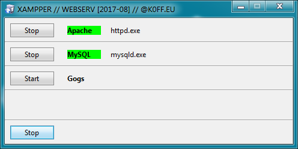

## XAMPPER ##

Xampper is simple and modulable GUI for WAMP inspired XAMPP

For more infornation see [xampper.ini](xampper.ini) or my private blog [@k0ff.eu/xampper](https://k0ff.eu/xampper) (for prefered polish support) and recommended [scoop.sh](http://scoop.sh/) package manager for Windows webmasters.

[DOWNLOAD](https://github.com/k0ff/xampper/raw/master/xampper.zip)